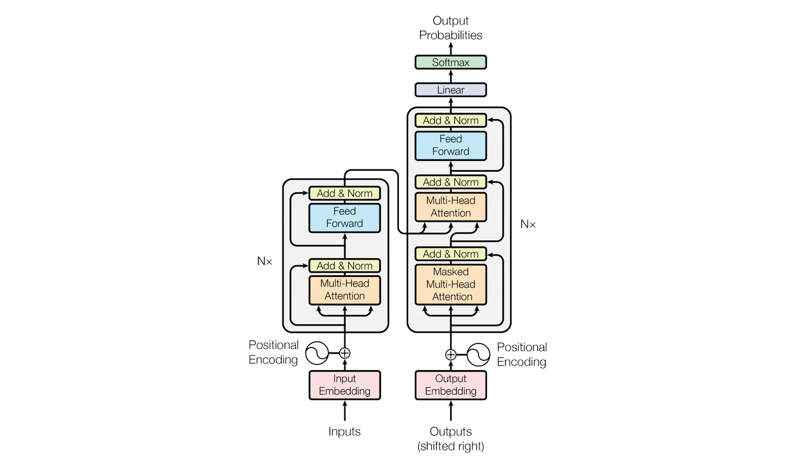
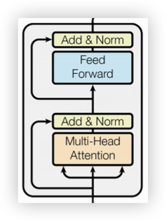
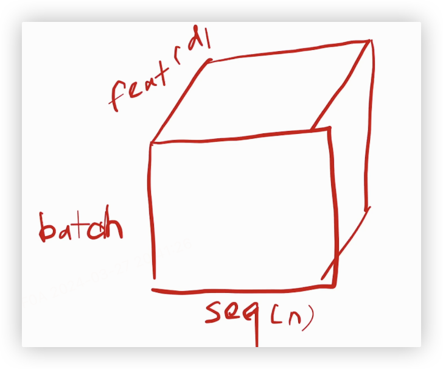
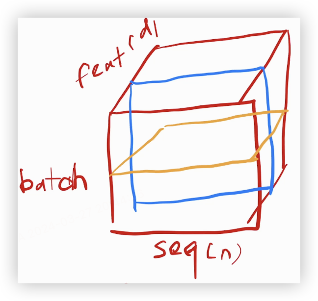
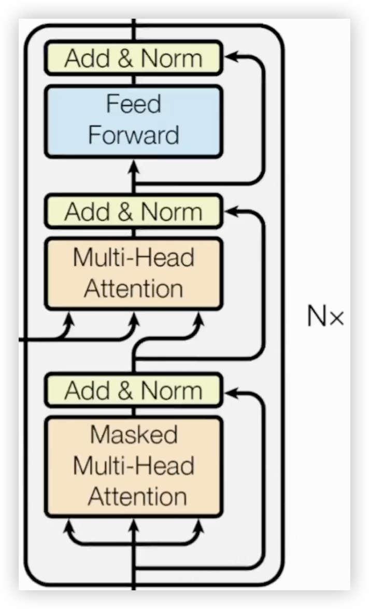
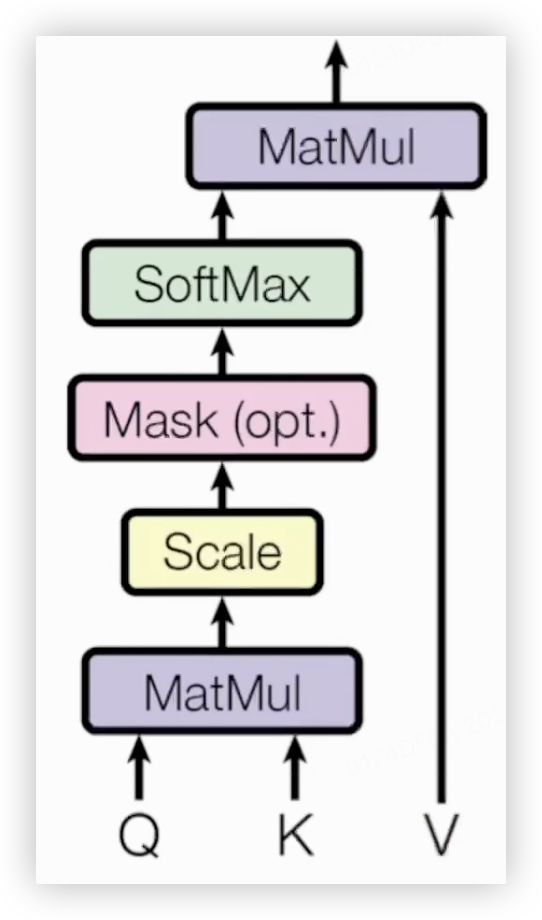
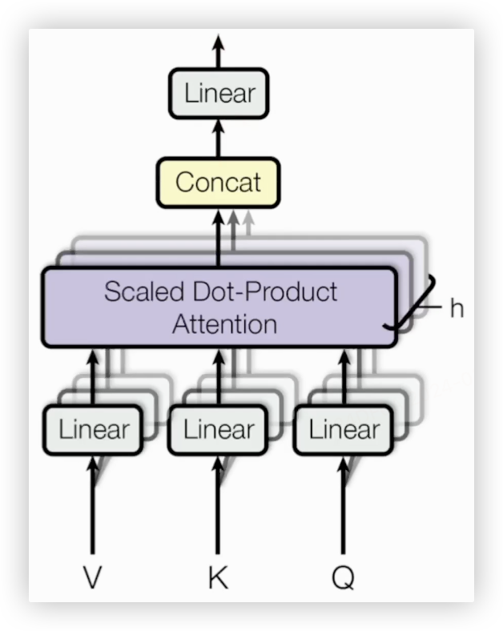

注意力机制。

编解码结构：

1. 输入$(x_1, \dots, x_n)$
2. 转换为$(z_1,\dots,z_n)$,其中$z_t$是一个向量，且z中所有元素的向量长度一致。相当于将输入进行了编码
3. 输出为$(y_1,\dots,y_n)$,计算$y_t$时需要用到的是$(y_1,\dots,y_{t-1})$,这样的计算方式称为自回归的（类似于RNN）

模型结构如图，左边为一个编码器，右边为一个解码器，因为解码器是使用的自回归的方式，因此解码器会将上一次的output作为下一次的输入。

### 编码器结构：$N$个编码单元

单个编码单元：一个多头注意力机制模块+$MLP$，子层之间通过残差连接加层归一化实现→$LayerNorm(x+Sublayer(x))$

论文中参数维度统一为一个$d_{model}=512$

因此，编码模块的超参数其实只有$N$和$d_{model}$

> 解释一下$LayerNorm$和$BatchNorm$的区别和选择原因。 从二维角度看，BN是取了每个样本的统一维的向量，做归一化（减去均值，除以方差）；LN是取了每个样本做归一化。 序列模型因为本身是二维的，每个batch是三维的。 其中seq就是序列长度，feature就是上文中的$d_{model}$。 BN是图中蓝色部分，沿batch平面切割，LN为黄色的部分，沿feature垂直于batch平面切割。

为什么LN用的会比BN多呢？ 两个原因：

1. 当输入序列长度变换比较大的时候，BN算出来的均值和方差的抖动比较大。且在预测是需要计算全局的均值和方差，当输入长度过长时，对整体影响较大。 2.LN是每个样本自身计算均值和方差进行归一化，不需要感知全局的均值和方差。（其实有文章解释LN好用的原因是提升了lipschitz常数）

>

### 解码器结构：$N$个编码单元

解码器比编码器多了一个子层，通过Mask多头注意力机制保证训练时模型对预测时刻后的输入不感知，保证训练和预测时的行为一致性。

### 注意力层

注意力机制是输入一个query和一些k-v对，计算query于所有key的相似度作为对应value的加权，然后计算所有value的加权合。因此输出的维度和value的维度是一致的。

query和key等长时：均为$d_k$

value长度为$d_v$

相似度计算方式为query和key做内积（内积值越大，相似度越高），计算完内积后除以$**\sqrt{d_k}**$，再通过一个$softmax$得到对应的权重（做$softmax$的原因是为了得到的权重和为 1，权重值负）

$Attention(Q,K,V)=softmax(\frac{QK^T}{\sqrt{d_k}})V$

这里解释一下除以$**\sqrt{d_k}**$的原因，当$d_k$较长时会导致计算出来的值比较大，反之值较小，为了尽量使$softmax$的结果置信度保持一致，通过除以$**\sqrt{d_k}**$起到一个平滑的作用。

### mask的实现：

解码器部分的注意力机制当前计算的是根据当前输入的query，计算已经算出来的所有k-v值上的注意力权重分布。

在计算时对超过当前长度的部分的计算值赋为大负数，实现在softmax计算后对应的权重为 0。

### 多头注意力

$MutilHead(Q,K,V)=Concat(head_1,\dots,head_n)W^O$

其中$head_i=Attention(QW_i^Q,KW_i^K,VW_i^V)$

加入多头注意力机制的原因是为了能够多一个能学习的参数将输入投影到低纬。

### Position Encoding

为了保证输入顺序变化时能感知到语意的变化。RNN本身自带时序信息，但是attention是对全局进行聚合，不感知时序信息，所以需要把位置信息加入到向量中。